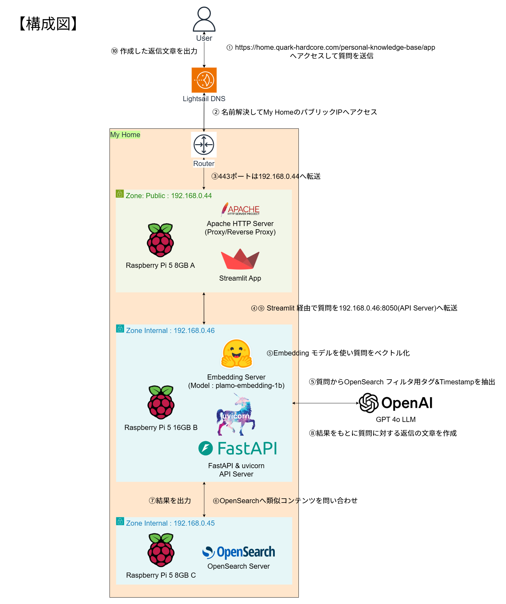

# これはなに

[nijigen-plot](https://x.com/nijigen_plot)([Quarkgabber](https://x.com/Quarkgabber))のナレッジベースです。
2012年からの過去ツイートと、2025年からちょいちょい入れてる日常系データをRAGとしています。



# 使い方

## StreamlitチャットBOT

質問に対する回答(conversation API)をしてくれるアプリ

https://home.quark-hardcore.com/personal-knowledge-base/app/


## API

以下API Docsを参照してください

- https://home.quark-hardcore.com/personal-knowledge-base/api/v1/docs
- https://home.quark-hardcore.com/personal-knowledge-base/api/v1/redoc


## MCP(Coming soon...)

# Setup

## .env

1. `cp .env.example .env`
2. .envの各項目に値を記入
3. `sudo apt-get install direnv`
4. `cp .envrc.example .envrc`
5. `sudo apt install nodejs npm`
6. `sudo npm install -g dotenv-cli`
7. `source ~/.bashrc` (.bashrcに`eval "$(direnv hook bash)"`があること前提)
8. `direnv allow`

## command flow

結局LLMはOpenAIが安定という結論になったので、デフォルトOPENAI APIを使っています。
.envに`OPENAPI_API_KEY=`があるのでそれにKEYいれてください。

1. install uv
2. run `uv sync --all-groups`
3. (必須ではない)get Hugging Face Write access token https://huggingface.co/docs/hub/security-tokens
4. (必須ではない)install [huggingface-cli](https://huggingface.co/docs/huggingface_hub/main/guides/cli)
5. (必須ではない)run `huggingface-cli login`
6. (必須ではない)paste Hugging Face access token
7. install [git lfs](https://github.com/git-lfs/git-lfs/wiki/Installation)
8. (必須ではない)clone llm repository `git clone git@hf.co:google/gemma-3-1b-it-qat-q4_0-gguf`(Need Write Permission Access Token)
9. git embedding model repository `git clone git@hf.co:pfnet/plamo-embedding-1b`
10. run `docker compose up -d` (OpenSearch Server 専用のサーバー 192.168.0.45があるのでそっちで立ち上げ済)
11. run `uv run pytest test_app.py` （単体テスト）
12. run `uv run uvicorn app:app --reload --port $APP_PORT --host $APP_HOST` or `uv run python app.py`(FastAPI立ち上げ)
13. run `uv run streamlit run streamlit_app.py --server.port $STREAMLIT_APP_PORT` (192.168.0.44 チャットBOT用Streamlit立ち上げ)


### daemon
- 192.168.0.46 : `/etc/systemd/system/personal-knowledge-base-fastapi.service`で起動時立ち上がるように設定済み。HOST,PORTは直接書いてるので要確認
- 192.168.0.44 : `/etc/systemd/system/personal-knowledge-base-streamlit.service`で起動時立ち上がるように設定済み。HOST,PORTは直接書いてるので要確認
    - `start_streamlit.sh`をdaemonで実行している

### Apache mod_proxy

## 過去データの挿入

FastAPI経由でリクエストを送ってデータ挿入が可能
ADMIN_API_KEYに設定した値をBearer Tokenとして認証が必要

接続確認
```
$ curl -i http://localhost:8050
HTTP/1.1 200 OK
date: Sun, 29 Jun 2025 14:05:07 GMT
server: uvicorn
content-length: 53
content-type: application/json

{"message":"ナレッジベースAPIへようこそ"}
```

データ挿入
```
url = f"http://localhost:8050/api/v1/documents"
response = requests.post(
    url,
    json=data,
    headers={
        "Content-Type": "application/json",
        "Authorization": f"Bearer {ADMIN_API_KEY}"
    },
    timeout=30
)
```

## LLMのテスト

普通の会話
```
$ uv run python llm.py "こんにちは～あなたのモデルはなんですか？"
2025-07-09 13:39:51,767 - __main__ - INFO - OpenAI APIクライアントを初期化しました
2025-07-09 13:39:51,767 - __main__ - INFO - history.txt から過去の会話履歴を読み込みました。
こんにちは～私はOpenAIのGPT-4oモデルで動作しています。
2025-07-09 13:39:54,381 - __main__ - INFO - 処理時間: 2.62秒
言語モデルのメモリを解放中...
言語モデルのメモリ解放完了
```


RAGを利用した会話
"debug": trueをbodyにいれるとベクトル検索で引っかかった文書内容も見れるよ
```
$ curl -X POST "http://localhost:8050/api/v1/conversation" \
    -H "Content-Type: application/json" \
    -H "Authorization: Bearer ADMIN_API_KEY" \
    -d '{
      "question": "最近あった出来事は？"
    }'
{"question":"最近あった出来事は？","answer":"最近の出来事といえば、曲の最後の詰めをしようとしていたときに、Wavesのプラグインの認証が急に通らなくなってしまったことがありました。ちょっと焦りましたが、PowerShell周りをいじったらなんとか直りました。ただ、Wavesのプラグインの認証周りは本当に勝手が悪くて、もう少しスムーズにいってほしいなと思っています。","search_results":[{"id":"WMFm5ZcBlg4zycrBZ0lN","score":0.78672117,"content":"曲最後の詰めやろうとしたら急にWavesの認証が通らなくなった・・・PowerShell周り弄ったら直ったけど、プラグイン認証周り勝手が悪いんだよなーWavesは","tag":"music","timestamp":"2025-07-05T18:00:00.000000"}],"search_count":1,"used_knowledge":true,"processing_time":6.18,"model_type":"openai","model_size":"4b"}
```


タグ抽出
```
$ uv run python llm.py "最近あった音楽関係の出来事は？" --extract-tag
2025-07-09 13:30:56,142 - __main__ - INFO - OpenAI APIクライアントを初期化しました
```json
{
  "tag": ["music"]
}
```
2025-07-09 13:30:58,831 - __main__ - INFO - 処理時間: 2.69秒
抽出結果 (試行 1/3): ```json
{
  "tag": ["music"]
}
```
{'content': '最近あった音楽関係の出来事は？', 'tag': 'music', 'timestamp': {'gte': '2025-07-02T22:30:56.142483', 'lte': '2025-07-09T22:30:56.142483'}}
言語モデルのメモリを解放中...
言語モデルのメモリ解放完了
```

## 構成

- OpenSearchは192.168.0.45でホスト（OpenSearch用サーバー）
- FastAPIは192.168.0.46でホスト（LLM+Embedding用サーバー）
- APIの公開は192.168.0.44がSSL証明書を持っている&プロキシサーバーを立てているのでリバースプロキシしてFastAPIにアクセスさせてます
    - 設定内容は192.168.0.44の`/etc/apache2/sites-enabled/`を参照

# API

## 入力構成

- Timestamp (自動ではいる)
    - Optionalにして過去文書を入れる時は明示できるようにする
- タグ(話題が何に関連するものなのか。LLM側でタグを自動で選定してくれる)
    - lifestyle, music, technology
- 質問文(自由入力)

# 開発

## Formatter/CI

`uv run pre-commit run --all-files`でコミット前にフォーマットチェック

# モデルのメモリ解放について

https://github.com/mjun0812/hf-model-cleanup-experiment

> export MALLOC_TRIM_THRESHOLD_=-1 + del model; gc.collect();で削除

gemma3.py, embedding_model.pyに内容は記載

# CPUメモ

1. Raspberry Pi 5はBCM2712 SoCで、CPUはArm Cortex-A76 (https://eetimes.itmedia.co.jp/ee/articles/2309/28/news177.html)
2. Cortex-A76はARM v8.2-Aアーキテクチャで半精度16bitの計算に対応している (https://en.wikipedia.org/wiki/AArch64#ARMv8.2-A)
3. Intel x86 CPUは4世代Xeonから半精度16bit計算対応で普通の人はまず持ってない (https://zenn.dev/mod_poppo/articles/half-precision-floating-point)
    a. 変換はIvy Bridgeから対応(3世代)

# Benchmarkメモ

4bは簡素で1bは文章量が多いので生成秒数が逆転している
リアルタイムで描画するようにしたらまた評価かわるかも
google gemma 3 1b ggufはめっちゃ速い 3~5秒くらい。Raspberry Pi 5なら7秒くらい

最終RAGをを分かったこととしては、Gemma 3 1b,4bはRAGのコンテキストを自分として活用するほどの能力はない。
ということで結局OpenAI API GPT 4oを使っています。

## i9-9980XE

- 4b -> 10秒程
- 1b -> 30秒程
- 1b gguf -> 3秒程

## Cortex-A76

- 4b -> 40~50秒
- 1b -> 40~50秒
- 1b gguf -> 7秒程
